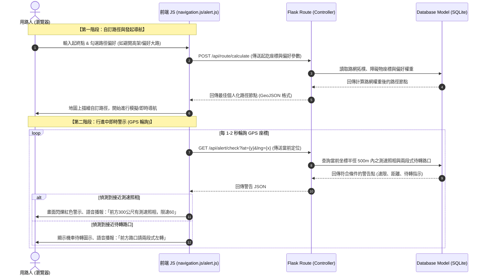

# Google Maps 地圖導航系統 - 系統架構設計文件

## 1. 技術架構說明

為了快速驗證概念並打造最小可行性產品 (MVP)，本專案採用輕量級的 **Python Flask** 框架，搭配 **Jinja2** 作為前端模板渲染引擎，並使用 **SQLite** 作為關聯式資料庫。

### 選用技術與原因
- **Python + Flask**：輕量級的微框架，具有極高的開發自由度與豐富的地理空間計算套件支援（如 `geopy`, `shapely`），非常適合快速原型開發。
- **Jinja2**：與 Flask 無縫整合的後端渲染引擎，直接在伺服器端渲染 HTML 頁面，有效降低前端框架（如 React/Vue）的架構複雜度與 API 設計成本。
- **SQLite**：無伺服器 (Serverless) 的輕量資料庫，資料直接儲存於單一檔案中，適合初期快速迭代與跨環境部署，同時支援基本的空間範圍欄位查詢。
- **Leaflet / OpenStreetMap JS (前端地圖庫)**：搭配前端 JavaScript，提供流暢的開源地圖縮放、路徑描繪、即時定位與圖標標記功能，無須昂貴的第三方地圖授權費用即可驗證 MVP。

### Flask MVC 模式說明
本專案採用經典的 MVC (Model-View-Controller) 架構模式來組織程式碼：
- **Model（模型）**：由 `app/models/` 負責，定義資料庫 schema 與物件關係，包含行程記錄、測速照相點資料、路口資訊以及路障回報。
- **View（視圖）**：由 `app/templates/` (Jinja2 HTML 模板) 與 `app/static/` (CSS/JS 靜態資源) 負責，呈現給用路人簡潔直觀的導航畫面、偏好設定表單、測速與待轉警示動畫。
- **Controller（控制器）**：由 `app/routes/` (Flask Blueprints 路由) 負責，接收使用者請求（例如起終點搜尋、路線偏好設定、回報路障），呼叫 Model 層處理數據，並將資料注入 Jinja2 模板中進行渲染或回傳 JSON API。

---

## 2. 專案資料夾結構

本系統採用模組化目錄結構，確保不同功能模組（導航、待轉、測速、路況回報）的職責分離：

```text
googlemaps/
├── app/
│   ├── __init__.py          # Flask 應用程式初始化與套件註冊
│   ├── models/              # Model 層 (SQLite 資料模型與關聯)
│   │   ├── route.py         # 行程記錄與個人化路徑偏好模型 (如避開高架、偏好大路)
│   │   ├── camera.py        # 測速照相點座標與速限模型
│   │   └── hazard.py        # 即時路況、交通事故與障礙物回報模型
│   ├── routes/              # Controller 層 (Flask 路由與 API 端點)
│   │   ├── main.py          # 核心導航地圖頁面與基礎路由
│   │   ├── route_pref.py    # 個人化路徑計算與偏好設定 API
│   │   ├── alert.py         # 即時待轉預告與測速相機查詢 API
│   │   └── hazard.py        # 即時路況回報、查詢與刪除 API
│   ├── templates/           # View 層 (Jinja2 模板)
│   │   ├── base.html        # 全域共用底版 (包含導航列、基礎樣式)
│   │   ├── map.html         # 核心地圖導航頁面 (整合地圖、即時警示與路況面板)
│   │   └── preferences.html # 個人化路徑偏好設定頁面
│   └── static/              # 靜態資源 (CSS, JS, 圖片)
│       ├── css/
│       │   └── style.css    # 核心樣式表 (包含日夜間模式、高對比切換與超速警報 CSS)
│       ├── js/
│       │   ├── map.js       # 地圖底層初始化與圖資載入 (Leaflet/OSM API)
│       │   ├── navigation.js# 起終點設定、動態路徑描繪與語音合成 (TTS) 控制
│       │   ├── alert.js     # 客戶端 GPS 定位輪詢、待轉路口與測速點即時偵測警示
│       │   └── hazard.js    # 即時路況回報提交、圖標點擊與地圖標記管理
│       └── images/          # 待轉指示牌、測速相機、警示路障等圖標 (Icon)
├── instance/
│   └── database.db          # SQLite 資料庫實體檔 (包含預載待轉路口、測速點)
├── docs/                    # 文件目錄
│   ├── PRD.md               # 產品需求文件
│   └── ARCHITECTURE.md      # 系統架構文件
├── app.py                   # 專案啟動入口檔 (開發伺服器 Entrypoint)
├── requirements.txt         # Python 套件依賴清單
└── .gitignore               # Git 版本控制忽略檔案
```

---

## 3. 元件關係圖

以下呈現用路人從發起導航、自訂路徑，到行進中接收「測速」與「待轉」即時警示的完整資料流向：



---

## 4. 關鍵設計決策

### 💡 決策一：前後端混合型導航架構 (Hybrid Server-Client Architecture)
- **決策**：不採用前後端完全分離（如 React + FastAPI），而是透過 Flask + Jinja2 渲染主要介面，並以輕量級前端 JavaScript (Vanilla JS) 處理地圖渲染、路線繪製與即時 GPS 警示。
- **原因**：地圖操作極度依賴前端瀏覽器的互動（例如拖拉、定位、瀏覽器語音合成 API），因此前端 JS 負責地圖渲染能帶來最流暢的效能；而後端 Flask 則專注於路徑偏好演算法運算與 SQLite 資料管理，兼顧開發速度 (MVP) 與操作流暢度。

### 💡 決策二：地理空間範圍的「矩形邊界查詢」優化 (Spatial Bounding Box Query)
- **決策**：在檢索測速照相或待轉路口時，後端不使用複雜的三角函數計算所有點的距離，而是利用當前 GPS 座標計算出一個矩形邊界框 (Bounding Box)，並使用 SQLite 進行 `BETWEEN` 數值區間查詢。
- **原因**：SQLite 沒有原生強大的 GIS 空間索引，如果直接計算每點的球面距離會造成伺服器 CPU 負載過大。利用 `lat BETWEEN min_lat AND max_lat` 與 `lng BETWEEN min_lng AND max_lng` 進行簡單的二分查詢，能在數毫秒內將篩選範圍縮小至數十個點，完美達成 **500 毫秒以內** 的即時警報回應需求。

### 💡 決策三：動態路網權重調整演算法 (Dynamic Road-Weight Adjuster)
- **決策**：後端路徑規劃演算法不僅計算最短物理距離，而是將使用者的「個人偏好」以及「即時路況/路障」轉換為路段的「通行權重（Weight）」。
- **原因**：例如，當使用者勾選「避開高架橋」，演算法會將所有高架路段的通行權重乘以 10 倍（處以極大懲罰值），迫使路徑規劃避開該路段；若某路段被回報有「嚴重車禍/路障」，該路段的權重也會即時調高，實現即時動態重新規劃路徑 (Re-routing) 的需求。

### 💡 決策四：前端瀏覽器原生語音合成與提醒 (Web Speech Synthesis API)
- **決策**：待轉預告與測速播報功能直接使用瀏覽器內建的 `window.speechSynthesis` 進行語音播報，不呼叫付費的雲端語音合成 API (如 Google Text-to-Speech)。
- **原因**：瀏覽器內建的 TTS API 完全免費、反應快速且零網路延遲，能保證在弱網環境下仍能正常語音播報，完全符合 MVP「語音導航提醒」的核心需求且零成本。
