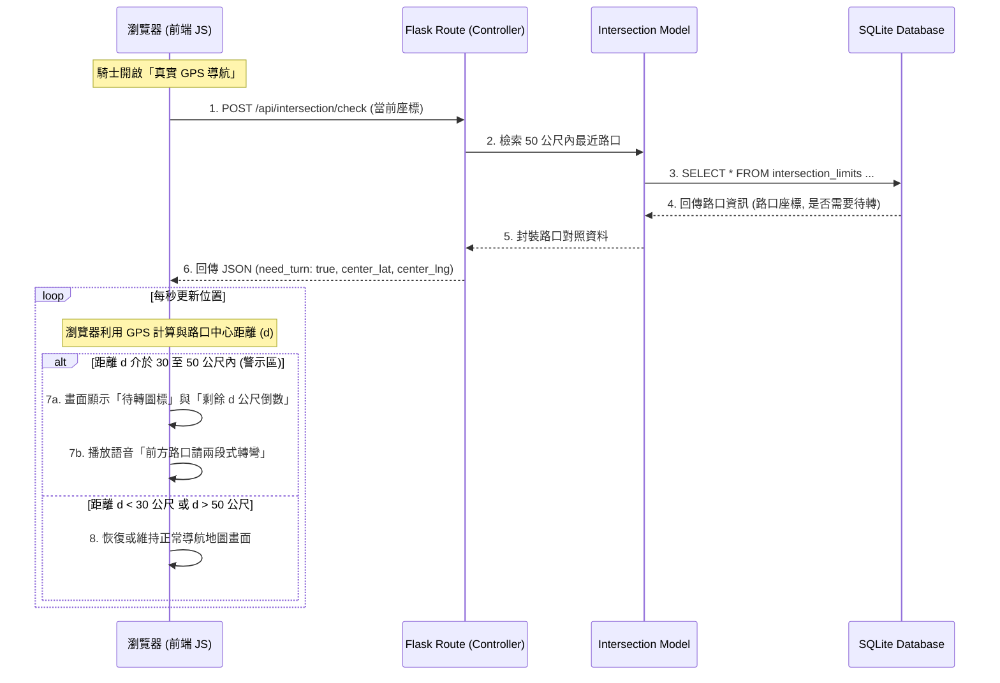
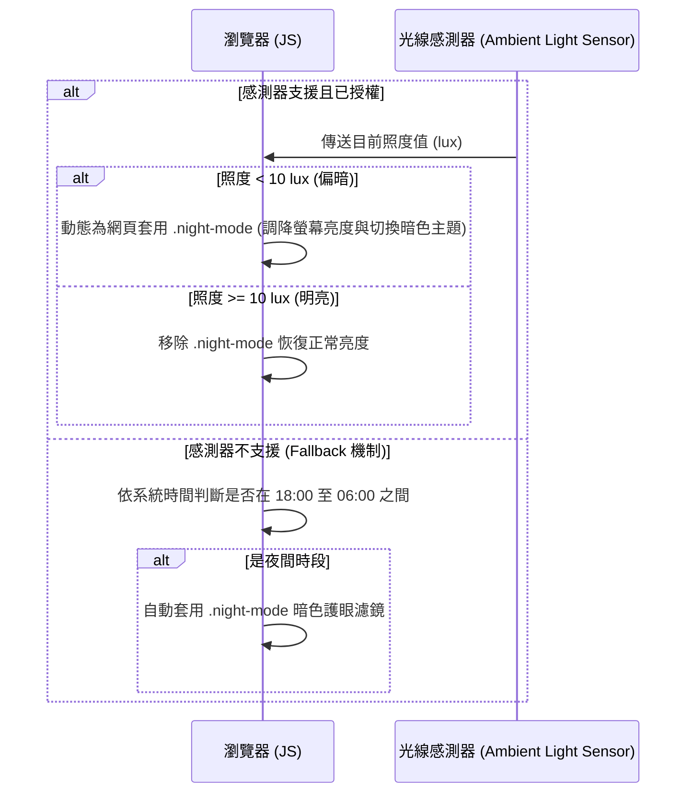

# 機車路口待轉預告系統架構文件

## 1. 技術架構說明

為了符合 MVP（最小可行性產品）低延遲、快速開發且易於展示的要求，本系統採用輕量級的 Python Flask 框架作為後端 API，搭配 Jinja2 模板渲染前端 HTML 頁面，並使用 SQLite 作為後端資料庫。
由於機車行駛時，對警示與倒數的「即時性」要求極高，本系統採用**「混合式架構」**：後端資料庫負責儲存與檢索路口規則資料，前端瀏覽器則負責 GPS 位置監聽、兩點距離高頻率計算與倒數、夜間亮度濾鏡調整，以將網路延遲對騎士行車安全的影響降到最低。

### 選用技術與原因
- **Python + Flask**：輕量、易於建置且啟動迅速，適合用來提供路口檢索 API。
- **Jinja2**：與 Flask 高度整合的模板引擎，負責一次性渲染地圖主頁及警示偏好設定頁面。
- **SQLite**：無須安裝獨立資料庫伺服器，資料儲存於單一檔案中，適合儲存路口標誌對照表與使用者設定。
- **前端 Web API (Geolocation, Speech Synthesis, CSS Filter)**：
  - 利用瀏覽器的 HTML5 Geolocation API 獲取騎士即時位置；
  - 使用 Web Speech API 的語音合成技術播放「前方路口請待轉」；
  - 結合 CSS 濾鏡（Filters）或暗色系樣式表，實作環境偵測夜間降亮。

### Flask MVC 模式說明
- **Model（模型）**：負責與 SQLite 進行互動。定義並管理`使用者設定`（`UserSettings`）與`路口待轉規則`（`IntersectionLimit`）的資料存取。
- **View（視圖）**：即 `templates` 下的 HTML 模板。負責呈現地圖、路口待轉標誌視覺警示、螢幕亮度降低濾鏡，以及前 50 公尺的公尺數即時倒數。
- **Controller（控制器）**：即 Flask 的 Routes 路由。負責接收前端傳來的經緯度，查詢離騎士最近的路口資訊並回傳 JSON 數據。

---

## 2. 專案資料夾結構

本系統採用模組化的 Flask 專案結構，各目錄與檔案的職責規劃如下：

```text
googlemaps/
├── app/
│   ├── __init__.py          # Flask 應用程式初始化與資料庫連線管理
│   ├── models/              # Model: 資料庫模型
│   │   ├── intersection.py  # 路口經緯度座標與待轉規則模型 (CRUD)
│   │   └── user_settings.py # 使用者警告偏好設定 (語音開關、警示距離門檻)
│   ├── routes/              # Controller: Flask 路由
│   │   ├── main.py          # 導航主頁、路口比對與待轉提醒 API
│   │   └── settings.py      # 偏好設定路由
│   ├── templates/           # View: Jinja2 HTML 模板
│   │   ├── base.html        # 共用模板（含導覽列、Leaflet 地圖庫與樣式載入）
│   │   ├── map.html         # 地圖與倒數儀表板（待轉大圖標、剩餘距離倒數、夜間感應濾鏡）
│   │   └── settings.html    # 偏好設定頁面（調整警示音開關、亮度模式設定）
│   └── static/              # 靜態資源
│       ├── css/
│       │   └── style.css    # 包含夜間減光樣式（.night-mode）與高對比警示 CSS
│       └── images/
│           └── two_stage_turn.png  # 兩段式左轉警示標誌圖檔
├── instance/
│   └── database.db          # SQLite 實體資料庫檔案
├── database/
│   └── schema.sql           # 資料庫 Schema 與初始模擬數據
├── docs/                    # 文件目錄
│   ├── PRD.md               # 產品需求文件
│   └── ARCHITECTURE.md      # 系統架構文件
├── app.py                   # 專案啟動入口檔
├── requirements.txt         # 套件依賴清單
└── .gitignore               # Git 忽略檔案設定
```

---

## 3. 元件關係圖

以下呈現瀏覽器前端、Flask 控制器、資料庫模型在「路口待轉警示與距離倒數」以及「環境偵測降亮」時的互動流程：

### A. 路口待轉預告與距離倒數流程


### B. 環境偵測降亮（夜間模式）流程


---

## 4. 關鍵設計決策

1. **前端高頻率距離倒數 (Client-Side Precision Distance Interpolation)**
   - **決策**：後端 API 僅比對並回傳「最近待轉路口的中心座標與規定」，而距離路口的公尺數倒數（如 `48m... 42m...`）則由前端 JavaScript 以高頻率 GPS 位置更新，在本地進行大圓距離（Haversine 公式）即時運算。
   - **原因**：若每次 GPS 位移都將座標送回後端計算距離再回傳，會受到網路傳輸延遲與伺服器處理時間影響，導致畫面的倒數數字出現「跳格」或卡頓，無法精確提醒騎士靠右或減速的最佳時機。

2. **環境光感應與時間排程雙軌制 (Dual-Track Night Mode Trigger)**
   - **決策**：使用瀏覽器原生的 `AmbientLightSensor` API 來感知周圍光線強度。若行動瀏覽器未開放此權限或不支援此感測器，系統會自動切換為「時間排程回退機制」（如系統時間在夜間 18:00 至 06:00 時觸發）。
   - **原因**：目前多數行動瀏覽器出於隱私考量對環境光感測器有較嚴格的限制。雙軌制能確保夜間騎乘時，系統不論感測器是否運作，都能切換成夜間低亮度暗色模式，保護騎士夜視力。

3. **50 公尺幾何地理圍欄 (Geofencing Detection Buffer)**
   - **決策**：後端 API 及前端判定只在騎士進入路口周圍 50 公尺（待轉黃金反應區）時才觸發警示與倒數計時。
   - **原因**：30~50 公尺在普通行車速限（40~50 km/h）下對應約 3~4 秒的反應時間，剛好是機車騎士收油門減速、查看燈號並安全朝右側車道切換的最佳反應緩衝距離。過早提醒（如 100 公尺前）會使警示干擾騎士日常行車，過晚提醒（如 20 公尺內）則容易造成緊急煞車的危險。
