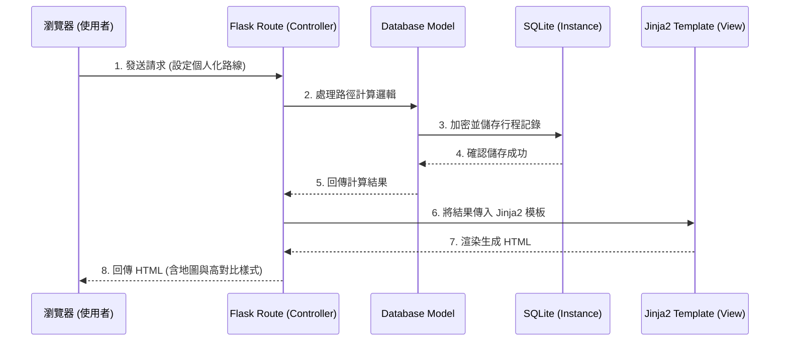

# 整合個人化路徑系統架構文件

## 1. 技術架構說明

為了快速驗證概念並打造 MVP（最小可行性產品），本專案採用輕量級的 Python Flask 框架，搭配 Jinja2 作為前端模板渲染引擎，並採用 SQLite 作為資料庫。

### 選用技術與原因
- **Python + Flask**：輕量且靈活，適合快速開發與驗證 MVP 功能。
- **Jinja2**：與 Flask 高度整合的模板引擎，能在伺服器端直接渲染動態資料，減少前端繁瑣的狀態管理與 API 開發時間。
- **SQLite**：無須額外設定資料庫伺服器，資料儲存於單一檔案中，適合初期資料量不大、重視開發速度的階段。

### Flask MVC 模式說明
本專案採用類似 MVC (Model-View-Controller) 的架構來組織程式碼：
- **Model（模型）**：負責與 SQLite 資料庫互動，定義資料結構（如使用者、行程記錄），處理資料的加密、儲存與讀取。
- **View（視圖）**：即 `templates` 目錄下的 Jinja2 HTML 檔案，負責畫面的呈現與使用者操作介面（包含高對比模式的樣式）。
- **Controller（控制器）**：即 Flask 的 Routes 路由，負責接收使用者的 HTTP 請求、呼叫 Model 處理商業邏輯（例如路徑計算、加密儲存），並將結果傳遞給 View 進行頁面渲染。

## 2. 專案資料夾結構

本系統將採用模組化的結構來管理不同職責的程式碼，結構如下：

```text
googlemaps/
├── app/
│   ├── __init__.py      # Flask 應用程式初始化檔案
│   ├── models/          # Model: 資料庫模型與資料處理邏輯
│   │   └── user_route.py # 行程紀錄與加密相關模型
│   ├── routes/          # Controller: Flask 路由與主要商業邏輯
│   │   ├── main.py      # 首頁與地圖主要邏輯
│   │   └── history.py   # 歷史行程記錄邏輯
│   ├── templates/       # View: Jinja2 HTML 模板
│   │   ├── base.html    # 共用版型（包含導覽列、基礎架構）
│   │   ├── map.html     # 主要地圖與導航介面（含高對比切換）
│   │   └── history.html # 行程記錄列表
│   └── static/          # 靜態資源檔案
│       ├── css/         # 樣式表（負責簡潔介面與高對比模式）
│       ├── js/          # 前端互動邏輯（路徑 API 呼叫、語音提醒）
│       └── images/      # 圖示與圖片資源
├── instance/
│   └── database.db      # SQLite 資料庫檔案 (不進版本控制)
├── docs/                # 文件目錄
│   ├── PRD.md           # 產品需求文件
│   └── ARCHITECTURE.md  # 系統架構文件
├── app.py               # 專案啟動入口檔
├── requirements.txt     # Python 依賴套件清單
└── .gitignore           # Git 忽略檔案設定
```

## 3. 元件關係圖

以下使用 Mermaid 語法呈現系統核心元件的互動流程：



## 4. 關鍵設計決策

1. **整合式後端渲染 (Server-Side Rendering)**
   - **決策**：不採用前後端分離架構，直接使用 Flask + Jinja2 渲染畫面。
   - **原因**：為了在初期快速驗證 MVP 功能，減少 API 介接成本與前端框架的學習曲線，讓開發團隊能更專注於個人化路線的商業邏輯實作。

2. **前端分離特定邏輯 (JavaScript 地圖與語音)**
   - **決策**：地圖的即時顯示、路徑計算 (3 秒內回應需求) 以及語音導航播報，交由前端 `static/js` 中的 JavaScript 處理。
   - **原因**：伺服器端渲染 HTML 效率雖高，但地圖互動與語音 API 依賴瀏覽器端的功能，將這些互動獨立為 JS 模組能提升操作流暢度，達到 3 秒內完成計算的效能需求。

3. **使用者行程資料的輕量化與加密**
   - **決策**：使用 SQLite 儲存資料，並在 Model 層實作基本的加解密邏輯。
   - **原因**：SQLite 不需額外建置伺服器，方便開發；針對 PRD 中要求的安全性，在寫入資料庫前將敏感路線資料進行加密，確保即使取得 `.db` 檔案也無法直接讀取使用者行程。

4. **樣式分離設計 (支援高對比模式)**
   - **決策**：在 `static/css` 中建立基礎樣式與高對比專用樣式（如 `.high-contrast` class）。
   - **原因**：透過單純的 CSS class 切換，即可滿足老人或戶外騎乘時對「高對比導航模式」的需求，無需重新載入頁面，操作更直觀簡潔。
