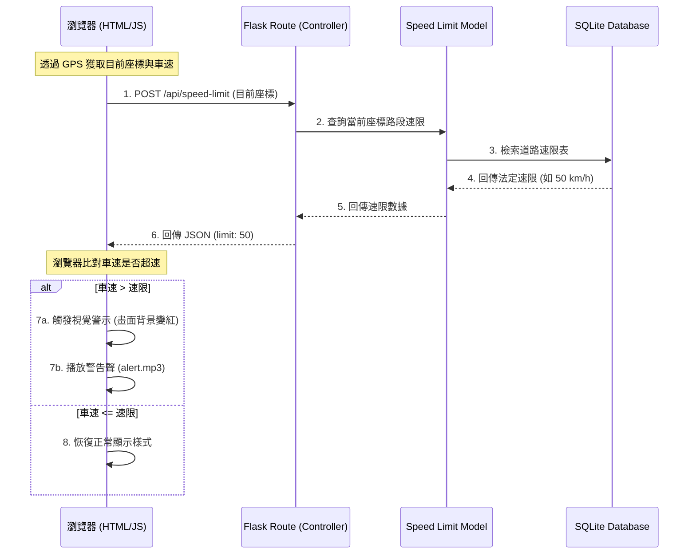
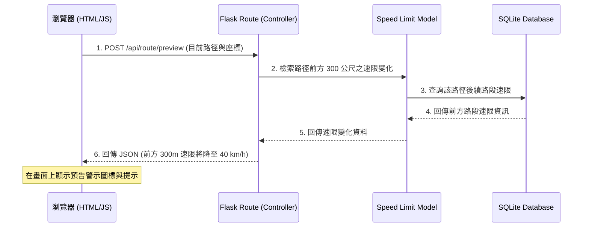

# 機車安全速限警示與預告系統架構文件

## 1. 技術架構說明

為了快速驗證概念並打造 MVP（最小可行性產品），本系統採用輕量級的 Python Flask 框架，搭配 Jinja2 作為前端模板渲染引擎，並使用 SQLite 作為後端資料庫。由於本系統為即時導航與警示系統，部分即時性要求極高的功能（如車速偵測、速限比對、畫面變紅與警告音效播放）將採用「後端提供速限數據與路徑計算，前端即時處理與渲染」的混合式架構。

### 選用技術與原因
- **Python + Flask**：輕量、易於建置 API，能快速回傳路徑上的速限資料。
- **Jinja2**：與 Flask 高度整合，用來快速渲染地圖主頁面及警示設定頁面。
- **SQLite**：無須額外安裝資料庫伺服器，資料儲存於單一檔案中，適合儲存道路速限對照表與使用者設定。
- **前端 Web API (HTML5 Geolocation & Web Audio)**：利用瀏覽器的 GPS 定位來獲取車速，並使用 Web Audio API 來即時播放警告聲，以符合低延遲的警示需求。

### Flask MVC 模式說明
- **Model（模型）**：負責與 SQLite 進行互動。定義與管理「道路速限對照資料」（`RoadSpeedLimit`）以及「使用者警示偏好設定」（`AlertSettings`），處理資料庫讀寫。
- **View（視圖）**：即 `templates` 下的 Jinja2 模板（如 `map.html`），負責呈現地圖、當前車速、道路速限以及超速時的視覺變化（如螢幕背景變紅）。
- **Controller（控制器）**：即 Flask 的 Routes 路由，負責接收前端 GPS 座標請求、查詢該路段的法定速限與前方速限變化預告資訊，並回傳給前端。

---

## 2. 專案資料夾結構

本系統採用模組化的 Flask 專案結構，各目錄與檔案的職責規劃如下：

```text
googlemaps/
├── app/
│   ├── __init__.py          # Flask 應用程式初始化與資料庫連接設定
│   ├── models/              # Model: 資料庫模型
│   │   ├── speed_limit.py   # 道路與速限資料查詢模型
│   │   └── user_settings.py # 使用者警告設定 (如警告門檻、是否開啟警告聲)
│   ├── routes/              # Controller: Flask 路由
│   │   ├── main.py          # 地圖首頁與前端 API（速限查詢、路線規劃）
│   │   └── settings.py      # 偏好設定路由
│   ├── templates/           # View: Jinja2 HTML 模板
│   │   ├── base.html        # 共用模板（含導覽列、基礎樣式載入）
│   │   ├── map.html         # 主要導航地圖頁面（含車速模擬、速限顯示、變紅警告區）
│   │   └── settings.html    # 警示偏好設定頁面
│   └── static/              # 靜態資源
│       ├── css/             # 樣式表
│       │   └── style.css    # 包含正常模式、超速變紅（.speeding-alert）的 CSS
│       ├── js/              # 前端邏輯
│       │   ├── map.js       # 地圖與路徑渲染
│       │   ├── speedometer.js # GPS 車速偵測與超速比對邏輯
│       │   └── audio.js     # 警告聲播放控制 (Web Audio API)
│       └── audio/
│           └── alert.mp3    # 超速警告音效檔
├── instance/
│   └── database.db          # SQLite 資料庫檔案
├── database/
│   └── schema.sql           # 資料庫 Schema 定義檔 (包含道路速限與設定表)
├── docs/                    # 文件目錄
│   ├── PRD.md               # 產品需求文件
│   └── ARCHITECTURE.md      # 系統架構文件
├── app.py                   # 專案啟動入口檔
├── requirements.txt         # 套件依賴清單
└── .gitignore               # Git 忽略檔案設定
```

---

## 3. 元件關係圖

以下呈現瀏覽器、Flask Route、Model、SQLite 之間，在「即時速限查詢與超速警示」以及「前方速限預告」時的元件互動流程：

### A. 即時車速比對與超速警示流程


### B. 前方路段速限變化預告流程


---

## 4. 關鍵設計決策

1. **混合式即時處理機制 (Hybrid Real-Time Processing)**
   - **決策**：將車速監測、超速比對與警示（視覺變紅、播放警告聲）全部置於前端 JavaScript 執行，而速限數據則由後端 Flask + SQLite 提供。
   - **原因**：如果每次車速改變都將資料傳回後端比對並等待後端回傳變色指令，將受限於網路延遲，無法達到 200 毫秒內的低延遲警示要求。前端本地進行車速與速限比對能保證毫秒級的即時反應。

2. **區段化前方速限預告演算法**
   - **決策**：後端 API 接收車輛當前座標與前進方向，檢索前方 300 公尺內的道路速限。若發現有速限降低之交界點，則在 API 中計算距離並回傳給前端。
   - **原因**：騎士行車速度較快，提前 300 公尺預告速限降低（例如從 60 降到 40）能提供約 15~20 秒的反應時間，足以讓騎士安全、平順地減速，避免緊急煞車造成的危險。

3. **輕量級 SQLite 空間座標網格化**
   - **決策**：在 SQLite 中使用經緯度網格或路段 ID (Segment ID) 來建立道路速限索引，而非使用繁重的 GIS 擴充套件。
   - **原因**：為了在無須複雜資料庫依賴的情況下於 SQLite 實作，利用簡單的座標範圍比對或路段代碼，即可快速檢索出當前位置的速限，並將路徑比對控制在 3 秒內。

4. **Web Audio API 與使用者互動限制優化**
   - **決策**：前端音效播放使用 Web Audio API，並在使用者首次點擊地圖「開始導航」時進行音訊上下文（AudioContext）解鎖。
   - **原因**：現代瀏覽器出於安全與體驗考量，禁止網頁在無使用者互動的情況下自動播放聲音。透過引導使用者點擊「開始導航」來解鎖音效，可確保超速警示聲能順利且無延遲地播放。
