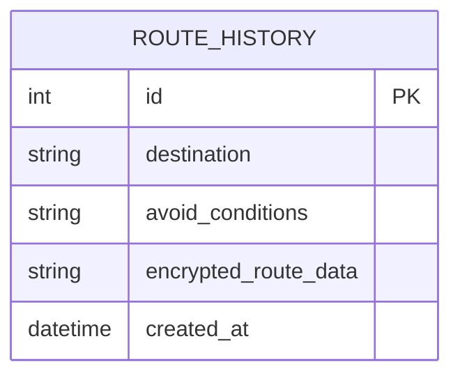

# 資料庫設計文件 (DB Design)

## 1. ER 圖（實體關係圖）

本系統目前為 MVP 階段，主要儲存使用者的歷史行程記錄。未來若擴增帳號系統，可再增加 `USER` 表。目前規劃單一核心資料表 `route_history`。

## 2. 資料表詳細說明

### 資料表：`route_history`

| 欄位名稱 | 型別 | 必填 | 說明 |
|---|---|---|---|
| `id` | INTEGER | 是 | Primary Key，自動遞增。唯一識別每筆行程記錄。 |
| `destination` | TEXT | 是 | 目的地的名稱或地址。 |
| `avoid_conditions` | TEXT | 否 | 使用者設定的避開條件（如「擁擠路段,危險路口」），可儲存為逗號分隔字串。 |
| `encrypted_route_data`| TEXT | 是 | 加密過後的路線座標及導航資料（JSON 序列化後加密），確保隱私安全。 |
| `created_at` | DATETIME | 否 | 記錄建立時間，預設為資料寫入當下的系統時間 (`CURRENT_TIMESTAMP`)。 |

> **設計考量**：因應 PRD 提到的「安全考量」，路線詳細資訊（如實際走過的座標路徑）涉及個人隱私，故在存入 `encrypted_route_data` 欄位前需在應用層（Model）進行加密處理。取出時再進行解密。

## 3. SQL 建表語法

完整的建表語法儲存於 `database/schema.sql`。

## 4. Python Model 程式碼

資料庫模型實作於 `app/models/user_route.py`，負責與 SQLite 進行互動，並包含了基本的 CRUD 操作以及資料寫入/讀取時的自動加解密機制。
