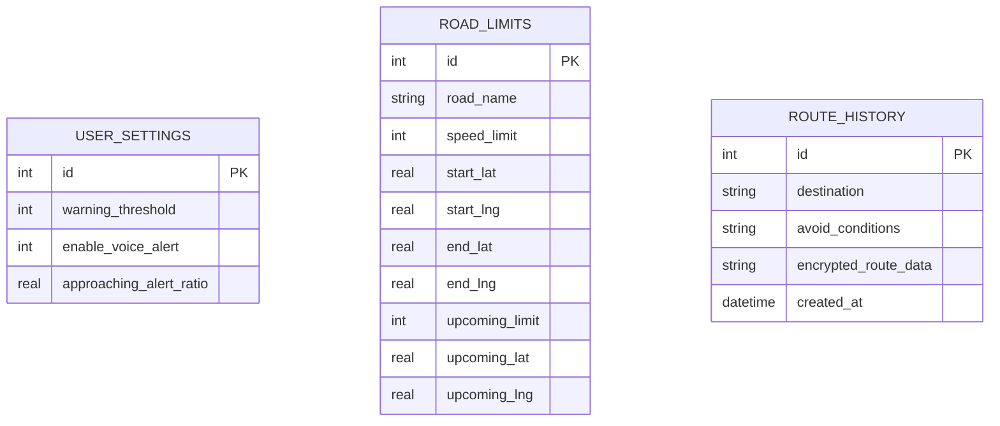

# 機車安全速限警示與預告系統資料庫設計文件

本文件詳細記錄了系統的 SQLite 資料表 Schema、欄位型別、關聯設計以及對應的 Python Model CRUD 操作規劃。

---

## 1. ER 圖（實體關係圖）

本系統包含三個資料表：
- `user_settings`（使用者警示偏好設定表，全域單一紀錄）
- `road_limits`（道路速限及預告座標對照表）
- `route_history`（歷史行程與導航紀錄表）



---

## 2. 資料表詳細說明

### A. 資料表：`user_settings`
儲存騎士的個人化警示偏好，如速限警告門檻與是否播放警告音效。

| 欄位名稱 | 型別 | 必填 | 預設值 | 說明 |
|---|---|---|---|---|
| `id` | INTEGER | 是 | - | Primary Key，自動遞增。全域設定唯一紀錄（通常 ID 為 1）。 |
| `warning_threshold` | INTEGER | 是 | 0 | 超速多少公里才觸發警示 (如：+0 km/h, +5 km/h, +10 km/h)。 |
| `enable_voice_alert` | INTEGER | 是 | 1 | 是否開啟警告聲 (0: 關閉, 1: 開啟)。 |
| `approaching_alert_ratio` | REAL | 是 | 0.9 | 接近速限警告比例 (如：0.9 代表達限速 90% 時觸發黃色警示)。 |

---

### B. 資料表：`road_limits`
儲存所有道路線段、法定速限以及該線段前方速限即將變化的預告點。

| 欄位名稱 | 型別 | 必填 | 預設值 | 說明 |
|---|---|---|---|---|
| `id` | INTEGER | 是 | - | Primary Key，自動遞增。唯一識別每段道路。 |
| `road_name` | TEXT | 是 | - | 道路名稱（例如：忠孝東路三段、北宜公路30K）。 |
| `speed_limit` | INTEGER | 是 | - | 該路段的法定最高速限 (如：50, 40)。 |
| `start_lat` | REAL | 是 | - | 道路線段起點緯度。 |
| `start_lng` | REAL | 是 | - | 道路線段起點經度。 |
| `end_lat` | REAL | 是 | - | 道路線段終點緯度。 |
| `end_lng` | REAL | 是 | - | 道路線段終點經度。 |
| `upcoming_limit` | INTEGER | 否 | NULL | 前方速限變更後的數值（若無變化則為 NULL）。 |
| `upcoming_lat` | REAL | 否 | NULL | 前方速限變更點（預告點）的緯度。 |
| `upcoming_lng` | REAL | 否 | NULL | 前方速限變更點（預告點）的經度。 |

---

### C. 資料表：`route_history`
儲存騎士過往規劃的行程目的地與加密後的路線資料。

| 欄位名稱 | 型別 | 必填 | 預設值 | 說明 |
|---|---|---|---|---|
| `id` | INTEGER | 是 | - | Primary Key，自動遞增。唯一識別每筆歷史行程。 |
| `destination` | TEXT | 是 | - | 目的地名稱或地址。 |
| `avoid_conditions` | TEXT | 否 | NULL | 避開條件（如：擁擠路段,危險路口）。 |
| `encrypted_route_data` | TEXT | 是 | - | 加密後的路線座標及導航資料 (Base64 加密 JSON 字串)。 |
| `created_at` | DATETIME | 否 | CURRENT_TIMESTAMP | 記錄建立時間。 |

---

## 3. SQL 建表語法
完整的建表語法儲存於 `database/schema.sql`，採用 SQLite 格式：

```sql
-- database/schema.sql

-- 1. 使用者設定表
CREATE TABLE IF NOT EXISTS user_settings (
    id INTEGER PRIMARY KEY AUTOINCREMENT,
    warning_threshold INTEGER NOT NULL DEFAULT 0,
    enable_voice_alert INTEGER NOT NULL DEFAULT 1,
    approaching_alert_ratio REAL NOT NULL DEFAULT 0.9
);

-- 2. 道路速限表
CREATE TABLE IF NOT EXISTS road_limits (
    id INTEGER PRIMARY KEY AUTOINCREMENT,
    road_name TEXT NOT NULL,
    speed_limit INTEGER NOT NULL,
    start_lat REAL NOT NULL,
    start_lng REAL NOT NULL,
    end_lat REAL NOT NULL,
    end_lng REAL NOT NULL,
    upcoming_limit INTEGER,
    upcoming_lat REAL,
    upcoming_lng REAL
);

-- 3. 歷史行程紀錄表
CREATE TABLE IF NOT EXISTS route_history (
    id INTEGER PRIMARY KEY AUTOINCREMENT,
    destination TEXT NOT NULL,
    avoid_conditions TEXT,
    encrypted_route_data TEXT NOT NULL,
    created_at DATETIME DEFAULT CURRENT_TIMESTAMP
);
```

---

## 4. Python Model 程式碼規劃

對應 Model 設計實作於 `app/models/` 資料夾：
1. **`user_settings.py`**:
   - `UserSettings` 類別，封裝對 `user_settings` 表的操作。
   - 由於設定檔通常只有一筆，提供 `get_settings()` 在查無資料時會自動初始化預設值，並提供 `update_settings()` 更新。
2. **`speed_limit.py`**:
   - `RoadSpeedLimit` 類別，封裝對 `road_limits` 表的操作。
   - 提供 `create()`、`get_all()`、`get_by_id()`、`update()`、`delete()` 標準 CRUD。
   - 額外提供 `find_nearest(lat, lng)` 空間幾何方法，用來計算並查詢離騎士當前 GPS 點最近的道路速限與預告變更資訊。
3. **`user_route.py`** (已存在):
   - `RouteHistory` 類別，維持原有對 `route_history` 表的操作，並支援路線資料加密/解密功能。
