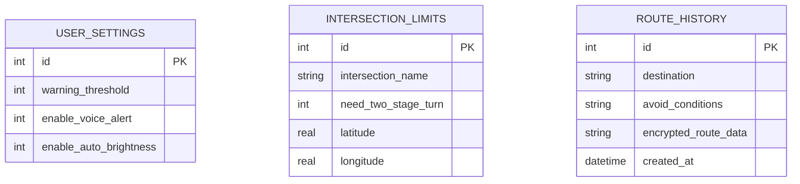

# 機車路口待轉預告系統資料庫設計文件

本文件詳細記錄了系統的 SQLite 資料表 Schema、欄位型別、關聯設計以及對應的 Python Model CRUD 操作規劃。

---

## 1. ER 圖（實體關係圖）

本系統包含三個資料表：
- `user_settings`（使用者待轉及亮度警示偏好設定表，全域單一紀錄）
- `intersection_limits`（路口待轉規則及座標對照表）
- `route_history`（歷史行程與導航紀錄表，保留相容性）



---

## 2. 資料表詳細說明

### A. 資料表：`user_settings`
儲存騎士的警示距離門檻、語音播放偏好以及環境偵測自動降亮設定。

| 欄位名稱 | 型別 | 必填 | 預設值 | 說明 |
|---|---|---|---|---|
| `id` | INTEGER | 是 | - | Primary Key，自動遞增。全域設定唯一紀錄（ID 恆為 1）。 |
| `warning_threshold` | INTEGER | 是 | 50 | 進入路口前多少公尺觸發警示與公尺倒數（預設為 50 公尺）。 |
| `enable_voice_alert` | INTEGER | 是 | 1 | 是否啟用「前方路口請待轉」語音警示 (0: 關閉, 1: 開啟)。 |
| `enable_auto_brightness` | INTEGER | 是 | 1 | 是否啟用環境光感應/夜間時間螢幕亮度自動調降 (0: 關閉, 1: 開啟)。 |

---

### B. 資料表：`intersection_limits`
儲存所有設有兩段式待轉指示之危險或大型路口的中心點與匹配資訊。

| 欄位名稱 | 型別 | 必填 | 預設值 | 說明 |
|---|---|---|---|---|
| `id` | INTEGER | 是 | - | Primary Key，自動遞增。唯一識別路口編號。 |
| `intersection_name` | TEXT | 是 | - | 路口區域名稱（例如：忠孝新生路口、羅斯福路和平東路口）。 |
| `need_two_stage_turn` | INTEGER | 是 | 1 | 該路口是否強制規定兩段式左轉/待轉 (0: 否, 1: 是)。 |
| `latitude` | REAL | 是 | - | 路口中心點緯度。 |
| `longitude` | REAL | 是 | - | 路口中心點經度。 |

---

### C. 資料表：`route_history`
儲存過往已規劃之導航行程與路線，維持歷史紀錄的系統相容。

| 欄位名稱 | 型別 | 必填 | 預設值 | 說明 |
|---|---|---|---|---|
| `id` | INTEGER | 是 | - | Primary Key，自動遞增。唯一識別每筆歷史行程。 |
| `destination` | TEXT | 是 | - | 目的地名稱。 |
| `avoid_conditions` | TEXT | 否 | NULL | 避開條件（如：擁擠路段）。 |
| `encrypted_route_data` | TEXT | 是 | - | 加密後的路線座標及導航資料 (Base64 加密 JSON)。 |
| `created_at` | DATETIME | 否 | CURRENT_TIMESTAMP | 記錄建立時間。 |

---

## 3. SQL 建表與初始化語法
完整的建表與初始化語法儲存於 `database/schema.sql`，採用 SQLite 格式：

```sql
-- database/schema.sql

-- 1. 使用者偏好設定表
CREATE TABLE IF NOT EXISTS user_settings (
    id INTEGER PRIMARY KEY AUTOINCREMENT,
    warning_threshold INTEGER NOT NULL DEFAULT 50,
    enable_voice_alert INTEGER NOT NULL DEFAULT 1,
    enable_auto_brightness INTEGER NOT NULL DEFAULT 1
);

-- 2. 路口待轉規則表
CREATE TABLE IF NOT EXISTS intersection_limits (
    id INTEGER PRIMARY KEY AUTOINCREMENT,
    intersection_name TEXT NOT NULL,
    need_two_stage_turn INTEGER NOT NULL DEFAULT 1,
    latitude REAL NOT NULL,
    longitude REAL NOT NULL
);

-- 3. 歷史行程紀錄表 (保留相容性)
CREATE TABLE IF NOT EXISTS route_history (
    id INTEGER PRIMARY KEY AUTOINCREMENT,
    destination TEXT NOT NULL,
    avoid_conditions TEXT,
    encrypted_route_data TEXT NOT NULL,
    created_at DATETIME DEFAULT CURRENT_TIMESTAMP
);
```

---

## 4. Python Model 程式碼規劃

對應 Model 實作於 `app/models/` 目錄：
1. **`user_settings.py`**:
   - 封裝對 `user_settings` 表的操作。
   - `get_settings()` 在查無資料時會自動初始化 ID 為 1 的預設設定；`update_settings()` 更新設定參數。
2. **`intersection.py`**:
   - 封裝對 `intersection_limits` 表的操作。
   - 提供 `create()`, `get_all()`, `get_by_id()`, `update()`, `delete()` 標準 CRUD。
   - 提供幾何距離比對 `find_nearest(lat, lng)` 方法，尋找並回傳距離指定座標最近的路口及實際大圓距離（公尺）。
3. **`user_route.py`**:
   - 保留對 `route_history` 行程紀錄表的加密儲存 CRUD 方法，以維持程式相容性。
