# Google Maps 地圖導航系統 - 資料庫設計與 Schema 規劃 (DB Design)

本系統採用輕量級的 **SQLite** 作為關聯式資料庫，並在 Python 應用層透過經典的 **sqlite3** 套件封裝 Models，實作高效能、低延遲的地理空間範圍檢索與 CRUD 邏輯。

---

## 1. ER 圖（實體關係圖）

在目前的 MVP 階段，本系統設計了 4 個相互解耦、高效運作的地理空間與使用者紀錄資料表。

```mermaid
erDiagram
    ROUTE_HISTORY {
        int id PK "INTEGER PRIMARY KEY AUTOINCREMENT"
        string destination "TEXT [NOT NULL] - 目的地名稱"
        string avoid_conditions "TEXT [NULL] - 使用者設定的避開條件"
        string encrypted_route_data "TEXT [NOT NULL] - 經 Base64 加密的詳細座標與導航行程"
        datetime created_at "DATETIME [DEFAULT CURRENT_TIMESTAMP]"
    }
    
    SPEED_CAMERA {
        int id PK "INTEGER PRIMARY KEY AUTOINCREMENT"
        real latitude "REAL [NOT NULL] - 測速點緯度"
        real longitude "REAL [NOT NULL] - 測速點經度"
        int speed_limit "INTEGER [NOT NULL] - 路段限速"
        string description "TEXT [NULL] - 備註說明"
        datetime created_at "DATETIME [DEFAULT CURRENT_TIMESTAMP]"
    }
    
    TWO_STAGE_TURN {
        int id PK "INTEGER PRIMARY KEY AUTOINCREMENT"
        real latitude "REAL [NOT NULL] - 待轉路口緯度"
        real longitude "REAL [NOT NULL] - 待轉路口經度"
        string description "TEXT [NULL] - 路口描述"
        datetime created_at "DATETIME [DEFAULT CURRENT_TIMESTAMP]"
    }
    
    HAZARD_REPORT {
        int id PK "INTEGER PRIMARY KEY AUTOINCREMENT"
        real latitude "REAL [NOT NULL] - 障礙點緯度"
        real longitude "REAL [NOT NULL] - 障礙點經度"
        string hazard_type "TEXT [NOT NULL] - 類型 (accident/construction/obstacle)"
        string description "TEXT [NULL] - 狀況詳情描述"
        int votes "INTEGER [DEFAULT 0] - 用路人覆核覆議數"
        datetime created_at "DATETIME [DEFAULT CURRENT_TIMESTAMP]"
    }
```



---

## 2. 資料表詳細說明

### 2.1. 行程歷史紀錄表：`route_history`
- **用途**：記錄用路人已完成的導航起訖行程，為維護使用者隱私，路線的詳細經緯度坐標序列會以 Base64 加密後存檔。
- **Primary Key**：`id` (自動遞增)

| 欄位名稱 | 資料型別 | 必填 | 預設值 | 說明 |
| :--- | :--- | :--- | :--- | :--- |
| `id` | INTEGER | 是 | | 主鍵，自動遞增。唯一識別每筆歷史紀錄。 |
| `destination` | TEXT | 是 | | 目的地之中文名稱或詳細地址。 |
| `avoid_conditions`| TEXT | 否 | | 自訂路線偏好條件（如「避開高架,偏好大路」）。 |
| `encrypted_route_data`| TEXT | 是 | | 經過加密的路線經緯度坐標陣列與導航中繼資料 (JSON 編碼後加密)。 |
| `created_at` | DATETIME | 否 | `CURRENT_TIMESTAMP` | 行程存檔建立時間。 |

---

### 2.2. 測速照相點資料表：`speed_camera`
- **用途**：預載或由系統管理員登錄的測速照相座標點，當用路人 GPS 接近該點 500 公尺內即觸發超速警告。
- **Primary Key**：`id` (自動遞增)

| 欄位名稱 | 資料型別 | 必填 | 預設值 | 說明 |
| :--- | :--- | :--- | :--- | :--- |
| `id` | INTEGER | 是 | | 主鍵，自動遞增。唯一識別每個測速點。 |
| `latitude` | REAL | 是 | | 測速相機所在之緯度坐標。 |
| `longitude` | REAL | 是 | | 測速相機所在之經度坐標。 |
| `speed_limit` | INTEGER | 是 | | 該路段之最高限速 (公里/小時)。 |
| `description` | TEXT | 否 | | 照相點路口描述（例如：「市民大道高架西向3.5K」）。 |
| `created_at` | DATETIME | 否 | `CURRENT_TIMESTAMP` | 測速點資料建立時間。 |

---

### 2.3. 兩段式待轉路口資料表：`two_stage_turn`
- **用途**：預載機車強制兩段式左轉路口。在機車導航模式下，接近此路口時提供圖示待轉預告與 TTS 播報。
- **Primary Key**：`id` (自動遞增)

| 欄位名稱 | 資料型別 | 必填 | 預設值 | 說明 |
| :--- | :--- | :--- | :--- | :--- |
| `id` | INTEGER | 是 | | 主鍵，自動遞增。唯一識別每個待轉路口。 |
| `latitude` | REAL | 是 | | 該待轉路口之緯度坐標。 |
| `longitude` | REAL | 是 | | 該待轉路口之經度坐標。 |
| `description` | TEXT | 否 | | 路段特徵描述（例如：「基隆路二段與和平東路三段路口」）。 |
| `created_at` | DATETIME | 否 | `CURRENT_TIMESTAMP` | 資料建立時間。 |

---

### 2.4. 即時路況與障礙物回報表：`hazard_report`
- **用途**：支援用路人在地圖上一鍵回報前方發生的即時事故、道路施工或路面障礙物。支援多用戶按讚覆核 (votes) 以確保真實性。
- **Primary Key**：`id` (自動遞增)

| 欄位名稱 | 資料型別 | 必填 | 預設值 | 說明 |
| :--- | :--- | :--- | :--- | :--- |
| `id` | INTEGER | 是 | | 主鍵，自動遞增。唯一識別該回報。 |
| `latitude` | REAL | 是 | | 障礙點所處之緯度坐標。 |
| `longitude` | REAL | 是 | | 障礙點所處之經度坐標。 |
| `hazard_type` | TEXT | 是 | | 路障類型。只允許 `'accident'`(車禍), `'construction'`(施工), `'obstacle'`(障礙物)。 |
| `description` | TEXT | 否 | | 用路人補充之即時備註描述。 |
| `votes` | INTEGER | 是 | `0` | 累計之覆核票數，可用於權重展示與防範惡意洗版。 |
| `created_at` | DATETIME | 否 | `CURRENT_TIMESTAMP` | 狀況發生回報時間，可用於自動清除過期路況。 |

---

## 3. SQL 建表語法 (SQLite)

完整的 SQL 建表指令均已寫入 [database/schema.sql](file:///c:/Users/Eric0302/googlemaps/database/schema.sql) 中，以確保開發與生產環境的一致性：

```sql
-- 1. 行程歷史紀錄表 (加密儲存，維護個人隱私)
CREATE TABLE IF NOT EXISTS route_history (
    id INTEGER PRIMARY KEY AUTOINCREMENT,
    destination TEXT NOT NULL,
    avoid_conditions TEXT,
    encrypted_route_data TEXT NOT NULL,
    created_at DATETIME DEFAULT CURRENT_TIMESTAMP
);

-- 2. 測速照相點資料表 (預載及自訂測速點，支援快速空間查詢)
CREATE TABLE IF NOT EXISTS speed_camera (
    id INTEGER PRIMARY KEY AUTOINCREMENT,
    latitude REAL NOT NULL,
    longitude REAL NOT NULL,
    speed_limit INTEGER NOT NULL,
    description TEXT,
    created_at DATETIME DEFAULT CURRENT_TIMESTAMP
);

-- 3. 兩段式待轉路口資料表 (預載待轉提示路口)
CREATE TABLE IF NOT EXISTS two_stage_turn (
    id INTEGER PRIMARY KEY AUTOINCREMENT,
    latitude REAL NOT NULL,
    longitude REAL NOT NULL,
    description TEXT,
    created_at DATETIME DEFAULT CURRENT_TIMESTAMP
);

-- 4. 即時路況與障礙物回報表 (用路人一鍵回報及按讚覆核)
CREATE TABLE IF NOT EXISTS hazard_report (
    id INTEGER PRIMARY KEY AUTOINCREMENT,
    latitude REAL NOT NULL,
    longitude REAL NOT NULL,
    hazard_type TEXT NOT NULL, -- 'accident' (車禍), 'construction' (施工), 'obstacle' (障礙物)
    description TEXT,
    votes INTEGER DEFAULT 0,  -- 覆核按讚數，可用於防刷及可信度篩選
    created_at DATETIME DEFAULT CURRENT_TIMESTAMP
);
```

---

## 4. Python Models 實作設計

所有 Models 均採用 SQLite 原生連線，實作於專案的 `app/models/` 目錄中，具備完整的 CRUD、欄位 Dict 對應及針對空間警示優化的查詢方法。

### 4.1. 行程加密模型：`RouteHistory`
- **實作路徑**：[app/models/user_route.py](file:///c:/Users/Eric0302/googlemaps/app/models/user_route.py)
- **特色**：採用屬性方法 `route_data`。當寫入資料庫時會將明文路線加密儲存；當讀取時會自動解密，確保業務邏輯層面無須手動加解密，兼顧隱私與便利性。

### 4.2. 測速照相模型：`SpeedCamera`
- **實作路徑**：[app/models/camera.py](file:///c:/Users/Eric0302/googlemaps/app/models/camera.py)
- **特色**：包含空間查詢優化方法 `get_nearby(lat, lng, radius_degree)`。利用經緯度的矩形邊界 (Bounding Box) 快速檢索 500m 範圍內的測速相機，避免大面積的三角運算，將查詢延遲控制在 **10ms** 以下。

### 4.3. 待轉路口模型：`TwoStageTurn`
- **實作路徑**：[app/models/two_stage_turn.py](file:///c:/Users/Eric0302/googlemaps/app/models/two_stage_turn.py)
- **特色**：實作 `get_nearby(lat, lng, radius_degree)` 方法篩選接近路口時（預設約 300m）的待轉告示，供前端立即呼叫並啟動待轉提醒。

### 4.4. 即時路況回報模型：`HazardReport`
- **實作路徑**：[app/models/hazard.py](file:///c:/Users/Eric0302/googlemaps/app/models/hazard.py)
- **特色**：實作 `upvote(hazard_id)` 讚數累加機制，以及 `get_nearby` 獲得周邊 5 公里的突發狀況標註，供動態路線規劃演算法 (Re-routing) 調高路段權重之用。
