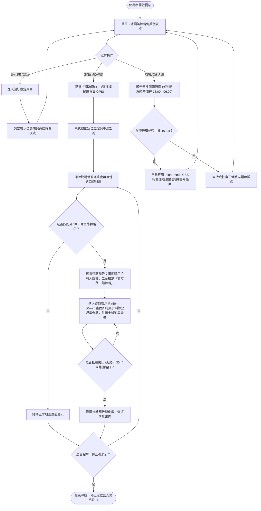
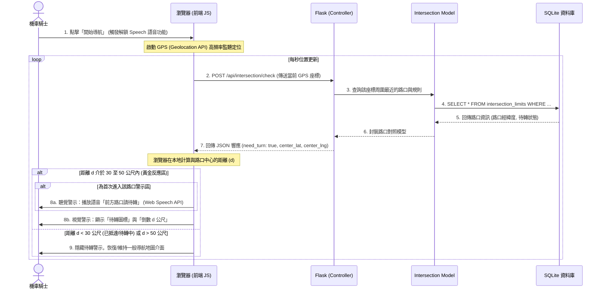

# 機車路口待轉預告系統流程圖

## 1. 使用者流程圖 (User Flow)

這張流程圖描述了機車騎士從進入系統、設定警示偏好，到開啟導航（模擬或真實 GPS）、即時比對待轉路口、倒數剩餘公尺，以及環境感光夜間降亮的完整操作與體驗路徑。

---

## 2. 系統序列圖 (Sequence Diagram)

本系統採混合式即時處理。以下呈現騎士開啟真實 GPS 導航、行經待轉路口時，瀏覽器前端、Flask API 與資料庫模型之間的元件通訊流程。

---

## 3. 功能清單對照表

以下為本系統的主要功能、對應的 URL 路徑、HTTP 方法及功能說明。

| 功能名稱 | URL 路徑 | HTTP 方法 | 說明 |
|---|---|---|---|
| **導航首頁 (地圖儀表板)** | `/` | `GET` | 渲染主地圖頁面，包含 Leaflet 地圖、定位狀態、大字體距離倒數與待轉視覺提醒。 |
| **偏好設定頁面** | `/settings` | `GET` | 渲染偏好設定表單，允許騎士設定語音警示開關、警示觸發門檻與亮度調整模式。 |
| **更新偏好設定** | `/settings` | `POST` | 接收表單送出的偏好設定資料並寫入 SQLite 資料庫儲存。 |
| **路口待轉檢查 API** | `/api/intersection/check` | `POST` | 接收騎士目前的經緯度，查詢 50 公尺內是否有符合待轉規則的路口，並回傳路口中心座標。 |
