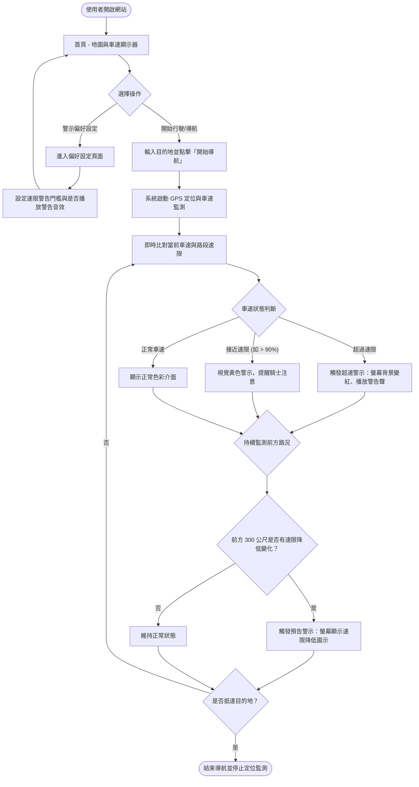
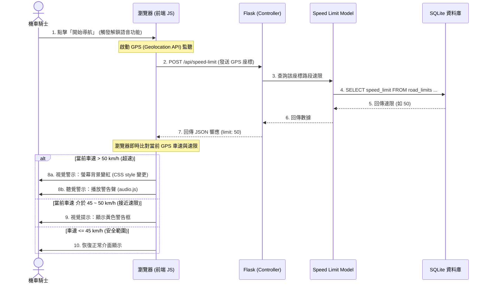
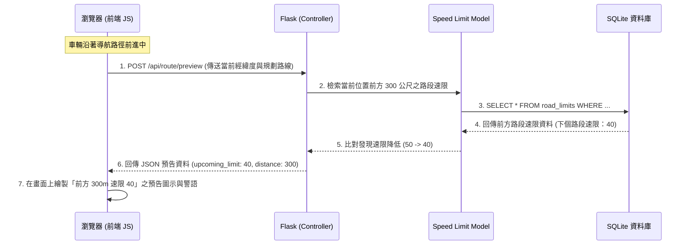

# 機車安全速限警示與預告系統流程圖

## 1. 使用者流程圖 (User Flow)

這張流程圖描述了機車騎士從進入系統、設定警示偏好，到開始導航、接收即時超速警示與前方速限預告的完整操作與體驗路徑。

## 2. 系統序列圖 (Sequence Diagram)

本系統採混合式即時處理，以下分別展示「即時車速比對警示」與「前方路段速限預告」的元件通訊流程。

### A. 即時車速比對與超速警示流程

### B. 前方路段速限變化預告流程

## 3. 功能清單對照表

以下為本系統的主要功能、對應的 URL 路徑、HTTP 方法及詳細功能說明。

| 功能名稱 | URL 路徑 | HTTP 方法 | 說明 |
|---|---|---|---|
| 導航主頁 (地圖與儀表板) | `/` | GET | 渲染系統首頁，包含 Leaflet 地圖、車速計儀表板、變紅警示遮罩等介面。 |
| 偏好設定頁面 | `/settings` | GET | 渲染設定頁面，允許騎士調整速限警示門檻（例如：速限 +5 km/h 才警告）以及音效開關。 |
| 更新偏好設定 | `/settings` | POST | 接收表單提交的偏好設定資料，將設定寫入 SQLite 中進行保存。 |
| 查詢當前路段速限 | `/api/speed-limit` | POST | 接收騎士目前的經緯度，經資料庫比對後回傳該路段的最新速限（JSON 格式）。 |
| 前方速限預告查詢 | `/api/route/preview` | POST | 接收騎士當前位置與前進路線，回傳前方 300 公尺內是否有速限降低之變化資訊。 |
