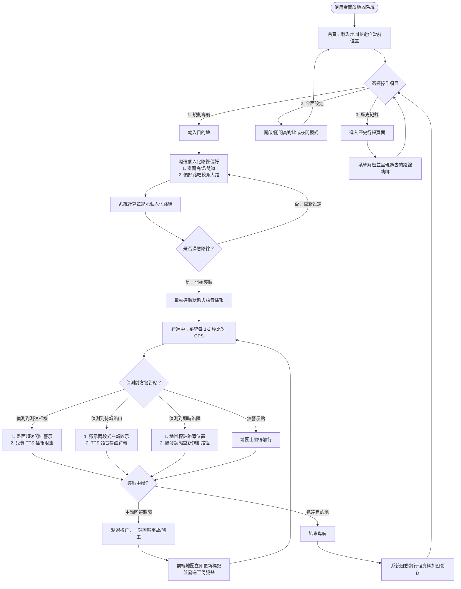
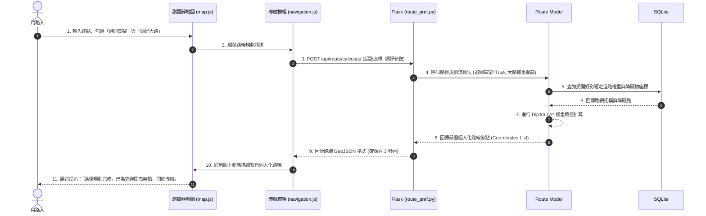
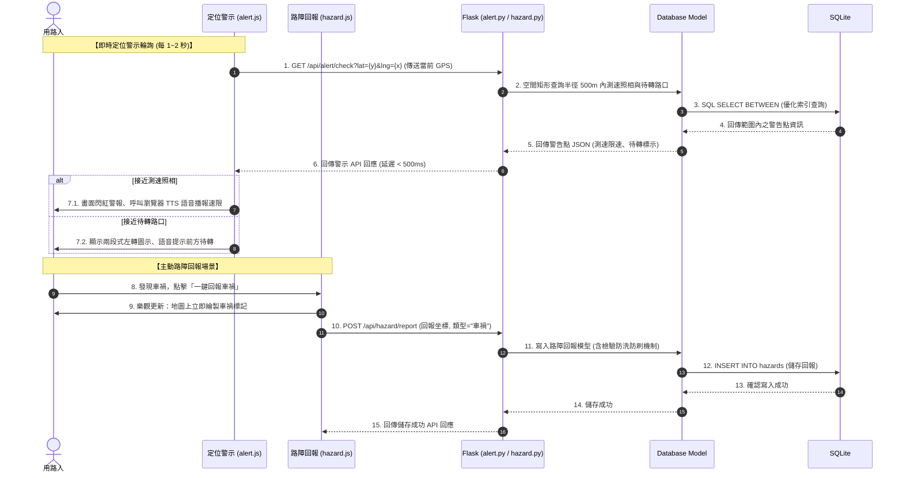

# Google Maps 地圖導航系統 - 系統流程圖與資料流設計

本文件詳細規劃了 **Google Maps 地圖導航系統** 的使用者操作路徑 (User Flow)、系統內部互動序列 (Sequence Diagram) 以及詳細的後端路由功能對照表，為開發團隊提供清晰的實作邏輯指南。

---

## 1. 使用者流程圖 (User Flow)

這張流程圖描述了用路人從進入系統、設定個人化條件、進行導航、即時警示與路況回報，一直到抵達目的地並查看歷史紀錄的完整操作路徑。

---

## 2. 系統序列圖 (Sequence Diagram)

為清晰呈現「前端地圖 UI」、「後端 Flask Controller」、「Database Model」與「SQLite」的職責，以下拆解為兩個核心場景的序列圖。

### 場景 A：發起導航與個人化路線規劃
本圖說明使用者在設定偏好後，系統如何快速計算並回傳 GeoJSON 路線格式。

### 場景 B：行進中即時 GPS 定位警示與路障回報
本圖說明行車中即時檢索 500m 內警告點，以及用路人一鍵回報路障的資料流。

---

## 3. 功能清單與 API 對照表

本系統的所有頁面與背景 API 設計如下，完全支援 MVC 模式並確保功能解耦：

| 功能模組 | 功能名稱 | URL 路徑 | HTTP 方法 | 傳入參數 (Request) | 傳出內容 (Response) | 說明 |
| :--- | :--- | :--- | :--- | :--- | :--- | :--- |
| **View (首頁)** | 首頁導航地圖 | `/` | `GET` | 無 | HTML 網頁 | 渲染包含 Leaflet 地圖、個人化偏好面板、警示圖示的主要導航介面。 |
| **Controller** | 計算個人化路線 | `/api/route/calculate` | `POST` | `{start: [y,x], end: [y,x], avoid_highways: bool, prefer_wide: bool}` | `GeoJSON` 格式的路線座標與屬性 | 根據起迄點與使用者的偏好設定，動態計算並回傳最佳個人化導航路徑。 |
| **Controller** | GPS 即時警示查詢 | `/api/alert/check` | `GET` | `?lat={y}&lng={x}` | `{cameras: [...], hook_turns: [...]}` | 接收使用者當前定位，回傳半徑 500m 內的待轉路口與測速點資訊。 |
| **Controller** | 回報即時路障 | `/api/hazard/report` | `POST` | `{lat: y, lng: x, type: "accident/construction/obstacle"}` | `{status: "success", hazard_id: int}` | 用路人一鍵回報路上突發狀況，寫入資料庫供其他用路人參考。 |
| **Controller** | 讀取所有路障 | `/api/hazard/list` | `GET` | `?lat={y}&lng={x}&radius_km=5` | `[{id: 1, lat: y, lng: x, type: "accident"}]` | 取得使用者周邊指定半徑內的所有活動路障，用以在地圖上標記。 |
| **View (歷史)** | 歷史行程列表 | `/history` | `GET` | 無 | HTML 網頁 | 讀取 SQLite 中的行程，解密後以清單與軌跡圖渲染給使用者。 |
| **Controller** | 儲存行程紀錄 | `/api/history/save` | `POST` | `{route_name: string, path: [[y,x]], duration: int}` | `{status: "success"}` | 導航結束時，系統自動將行駛路徑、時間等敏感情資「加密」存入資料庫。 |
