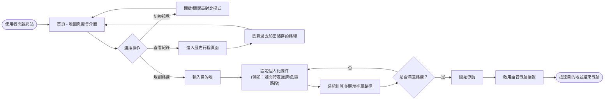
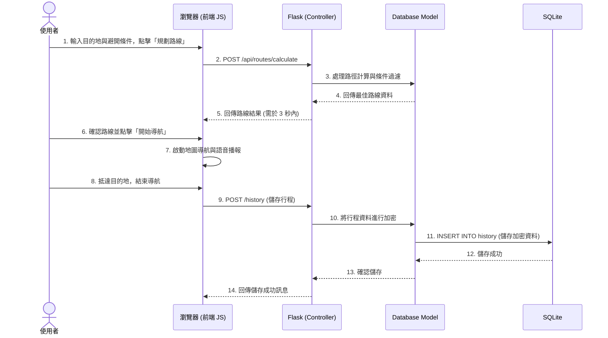

# 整合個人化路徑系統流程圖

## 1. 使用者流程圖 (User Flow)

這張流程圖描述了使用者從進入系統到完成路線導航與查看歷史紀錄的完整操作路徑。

## 2. 系統序列圖 (Sequence Diagram)

此序列圖展示了當使用者規劃路線並在導航結束後儲存紀錄時，資料在系統內部（前端、Flask 路由、資料庫）的流動方式。

## 3. 功能清單對照表

以下為系統核心功能與其對應的 URL 路徑、HTTP 方法及說明。

| 功能名稱 | URL 路徑 | HTTP 方法 | 說明 |
|---|---|---|---|
| 首頁 (地圖與導航) | `/` | GET | 渲染主地圖頁面，提供搜尋與條件設定介面（含高對比切換按鈕） |
| 計算個人化路線 | `/api/routes/calculate` | POST | 接收目的地與偏好條件，回傳計算後的路徑座標資料（JSON 格式） |
| 儲存行程紀錄 | `/history` | POST | 接收完成導航的行程資料，將其加密後儲存至資料庫 |
| 查看歷史行程 | `/history` | GET | 渲染歷史紀錄列表頁面，從資料庫讀取並解密顯示給使用者 |
